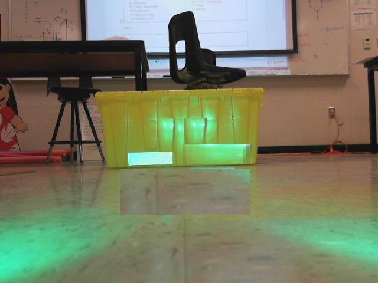

# Week 6 HW

### The Assignment

Write a program that analyzes the image given.
Given that the focal length of the camera is 480px and the width of that lit up rectangle is 0.1 m, calculate the distance and azimuth to the rectangles.

Distance Hint: Like we went over in class, you can use similar triangles to find the distance. P, or image width, can be calculated by taking the leftmost point of the object and subtract it from the rightmost point . This is why contours come in handy because you can compare the points to each other. Note we are only talking about the x-axis at the moment.

Azimuth Hint: The offset in the equation is found by subtracting the centers of the target image and whole image. Finding the center of the target image requires the use of averaging the points. After that just take the arc tangent(atan) of the ratio as explained in the slides.

### Turning it in

As usual, fork [this repo](https://github.com/compvision/week6hw), and put your code, and submit a pull request.
